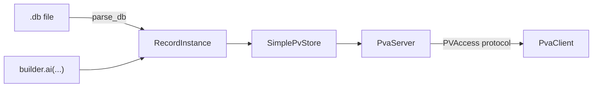
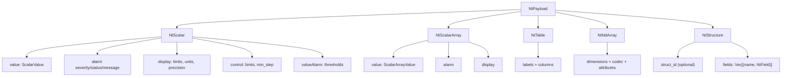
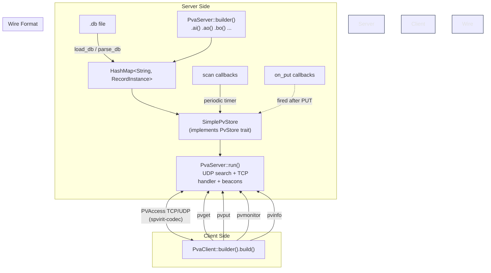

# Spvirit

[](https://crates.io/crates/spvirit-types)
[](https://crates.io/crates/spvirit-codec)
[](https://crates.io/crates/spvirit-client)
[](https://crates.io/crates/spvirit-server)
[](https://crates.io/crates/spvirit-tools)
[](LICENSE)

*/ˈspɪrɪt/ of the Machine* 

Spvirit is a Rust library for working with EPICS PVAccess protocol, including encoding/decoding and connection state tracking. It also includes tools for monitoring and testing PVAccess connections. These are not yet production ready , but they are available for anyone to use and contribute to.

Key areas of development in the near future include:
- More complete support for EPICS Normative Types (NT) and their associated metadata.
- Expanding `spvirit-server` with more complete softIOC behaviours and record processing.

## Why Rust? 

Because why not, admittedly I just wanted to learn Rust and this seemed like a fun project with a moderately useful outcome.

## Project Structure
The project is structured as a Cargo workspace with five crates:
- `spvirit-types`: Shared data model types for PVAccess Normative Types (NT).
- `spvirit-codec`: PVAccess protocol encoding/decoding logic and connection state tracking.
- `spvirit-client`: Client library — search, connect, get, put, monitor.
- `spvirit-server`: Server library — db parsing, PV store trait, PVAccess server runtime.
- `spvirit-tools`: Command-line tools (CLI binaries) for monitoring and testing PVAccess connections.

## Key Concepts

If you're new to EPICS or PVAccess, the terminology can be confusing. This section explains the key concepts and how they map to Spvirit's Rust types.

### PVs, Records, and .db files

In EPICS, a **Process Variable (PV)** is a named data point — a temperature reading, a motor position, or a shutter state. PVs are the things clients read and write over the network.

On the server side, each PV is backed by a **Record**. A record has a **type** (`ai`, `ao`, `bi`, `bo`, `waveform`, etc.) that determines its behaviour: whether it's read-only or writable, what data shape it holds, and what processing it does.

Records are usually declared in **`.db` files** — plain-text configuration files using the EPICS database syntax:

```
record(ai, "SIM:TEMPERATURE") {
    field(DESC, "Simulated sensor")
    field(EGU,  "degC")
    field(PREC, "2")
    field(HOPR, "100")
    field(LOPR, "-20")
}

record(ao, "SIM:SETPOINT") {
    field(DESC, "Target temperature")
    field(EGU,  "degC")
    field(DRVH, "100")
    field(DRVL, "0")
}
```

In Spvirit, a `RecordInstance` holds all of this — the record type, the current value (as a Normative Type), and the common fields. You can either build records in code with `PvaServer::builder().ai(...)` or load them from `.db` files with `.db_file("path.db")`.



### Record Types at a Glance

| Record Type | Rust Builder | Direction | Data Shape | Typical Use |
|---|---|---|---|---|
| `ai` | `.ai(name, f64)` | Input (read-only) | Scalar | Sensor readings |
| `ao` | `.ao(name, f64)` | Output (writable) | Scalar | Setpoints, commands |
| `bi` | `.bi(name, bool)` | Input (read-only) | Boolean | Status bits |
| `bo` | `.bo(name, bool)` | Output (writable) | Boolean | On/off switches |
| `stringin` | `.string_in(name, str)` | Input (read-only) | String | Status messages |
| `stringout` | `.string_out(name, str)` | Output (writable) | String | Text commands |
| `waveform` | `.waveform(name, data)` | Writable | Array | Spectra, traces |

**Input** records are read-only from the client's perspective — values are produced by the server (scan callbacks, hardware, simulation). **Output** records accept writes from PVAccess clients (PUT operations).

### Normative Types (NT)

The PVAccess protocol doesn't send plain numbers — it sends structured payloads called **Normative Types**. These wrap the actual value with rich metadata (alarm state, timestamp, display limits, engineering units, etc.).



The Normative Type variants exposed by Spvirit:

| Normative Type | Rust Type | Backed by | Used for |
|---|---|---|---|
| NTScalar | `NtScalar` | `ScalarValue` (f64, i32, bool, String, …) | Single-value PVs (`ai`, `ao`, `bi`, `bo`, etc.) |
| NTScalarArray | `NtScalarArray` | `ScalarArrayValue` (Vec\<f64\>, Vec\<i32\>, …) | Array PVs (`waveform`, `aai`, `aao`) |
| NTTable | `NtTable` | Named columns of `ScalarArrayValue` | Tabular data |
| NTNDArray | `NtNdArray` | `ScalarArrayValue` + dimensions + attributes | Image / detector data (areaDetector) |
| Generic Structure | `NtStructure` | nested `Scalar` / `ScalarArray` / `Structure` fields | QSRV group PVs, ad-hoc composite PVs |

> **Note** `NtPayload` is `#[non_exhaustive]` since 0.2.0 — `match` on it
> must include a wildcard arm. The `Generic Structure` variant carries
> arbitrary nested fields but **not** unions, struct-arrays, or variant
> types; if you need those, extend `NtField` rather than working around
> the limit at the call site.

### Enums in EPICS (bi/bo and ZNAM/ONAM)

EPICS doesn't have a first-class enum type like Rust. Instead, **binary records** (`bi`/`bo`) use two string labels — `ZNAM` (the "zero" name) and `ONAM` (the "one" name) — to map a boolean value to human-readable choices:

```
record(bo, "SHUTTER:CTRL") {
    field(ZNAM, "Closed")
    field(ONAM, "Open")
}
```

When a client reads this PV, the NTScalar's value is the integer index (0 or 1), and the `display.form.choices` field carries `["Closed", "Open"]` so the UI can show a dropdown. In Spvirit, `bi`/`bo` records store the underlying value as `ScalarValue::Bool` and the labels in the `znam`/`onam` fields of `RecordData::Bi` / `RecordData::Bo`.

### How it all fits together



## Getting Started

### Install Rust 
``` bash
# Linux
curl --proto '=https' --tlsv1.2 -sSf https://sh.rustup.rs | sh
```
### clone the repo
``` bash
git clone https://github.com/ISISNeutronMuon/spvirit
```
### Build the project
``` bash
cd spvirit
cargo build --release
```

### Run the tools
``` bash
cargo run --bin spmonitor my:pv:name
# or
./target/release/spmonitor my:pv:name
# or if installed 
cargo install spvirit-tools

spmonitor my:pv:name
```
### Using the library in your own Rust project

Add the crates you need to your `Cargo.toml`:
```toml
[dependencies]
spvirit-client = "0.2"   # client library: search, connect, get, put, monitor
spvirit-server = "0.2"   # server library: db parsing, PvStore trait, PVA server
spvirit-codec  = "0.2"   # low-level PVA protocol encode/decode
spvirit-types  = "0.2"   # shared Normative Type data model
spvirit-tools  = "0.2"   # all of the above + CLI tool helpers
```

#### Fetching a PV value (pvget)
```rust
use spvirit_client::PvaClient;

#[tokio::main]
async fn main() -> Result<(), Box<dyn std::error::Error>> {
    let client = PvaClient::builder().build();
    let result = client.pvget("MY:PV:NAME").await?;
    println!("{}: {}", result.pv_name, result.value);
    Ok(())
}
```
```bash
cargo run -p spvirit-client --example pvget
```

#### Writing a value to a PV (pvput)
```rust
use spvirit_client::PvaClient;

#[tokio::main]
async fn main() -> Result<(), Box<dyn std::error::Error>> {
    let client = PvaClient::builder().build();
    client.pvput("MY:PV:NAME", 42.0).await?;
    println!("OK");
    Ok(())
}
```
```bash
cargo run -p spvirit-client --example pvput
```

#### Monitoring a PV for live updates (pvmonitor)
```rust
use std::ops::ControlFlow;
use spvirit_client::PvaClient;

#[tokio::main]
async fn main() -> Result<(), Box<dyn std::error::Error>> {
    let client = PvaClient::builder().build();
    client.pvmonitor("MY:PV:NAME", |value| {
        println!("{value}");
        ControlFlow::Continue(())   // return Break(()) to stop
    }).await?;
    Ok(())
}
```
```bash
cargo run -p spvirit-client --example pvmonitor
```

#### Running a PVAccess server
```rust
use spvirit_server::PvaServer;

#[tokio::main]
async fn main() -> Result<(), Box<dyn std::error::Error>> {
    let server = PvaServer::builder()
        .ai("SIM:TEMPERATURE", 22.5)
        .ao("SIM:SETPOINT", 25.0)
        .bo("SIM:ENABLE", false)
        .build();

    server.run().await
}
```
```bash
cargo run -p spvirit-server --example simple_server
```

#### Reacting to client writes (`on_put`)
Register a callback that fires whenever a PVAccess client writes to a PV:
```rust
use spvirit_server::PvaServer;

#[tokio::main]
async fn main() -> Result<(), Box<dyn std::error::Error>> {
    let server = PvaServer::builder()
        .ao("SIM:SETPOINT", 25.0)
        .on_put("SIM:SETPOINT", |pv, val| {
            // `val` is a DecodedValue — the raw structure sent by the client
            println!("{pv} was set to {val:?}");
        })
        .build();

    server.run().await
}
```
```bash
cargo run -p spvirit-server --example on_put
```

#### Reading and writing PVs at runtime (`store()`)
The `store()` handle lets your own code read and write PV values while the server is running — useful for simulation loops, hardware I/O, or responding to external events:
```rust
use spvirit_server::PvaServer;
use spvirit_types::ScalarValue;

#[tokio::main]
async fn main() -> Result<(), Box<dyn std::error::Error>> {
    let server = PvaServer::builder()
        .ai("SIM:TEMPERATURE", 22.5)
        .ao("SIM:SETPOINT", 25.0)
        .build();

    let store = server.store().clone();

    // Spawn a task that reads/writes PVs independently
    tokio::spawn(async move {
        loop {
            // Read the current setpoint (like an on_get)
            if let Some(sp) = store.get_value("SIM:SETPOINT").await {
                println!("Current setpoint: {sp:?}");
            }

            // Push a new temperature reading
            store.set_value("SIM:TEMPERATURE", ScalarValue::F64(23.1)).await;

            tokio::time::sleep(std::time::Duration::from_secs(1)).await;
        }
    });

    server.run().await
}
```
```bash
cargo run -p spvirit-server --example store_runtime
```

#### Periodic scan callbacks
Use `.scan()` to produce new values on a timer — the server pushes updates to any monitoring clients automatically:
```rust
use spvirit_server::PvaServer;
use spvirit_types::ScalarValue;
use std::sync::atomic::{AtomicU64, Ordering};
use std::time::Duration;

static TICK: AtomicU64 = AtomicU64::new(0);

#[tokio::main]
async fn main() -> Result<(), Box<dyn std::error::Error>> {
    let server = PvaServer::builder()
        .ai("SIM:TEMPERATURE", 22.5)
        .scan("SIM:TEMPERATURE", Duration::from_millis(100), |_pv| {
            let t = TICK.fetch_add(1, Ordering::Relaxed) as f64;
            ScalarValue::F64(22.5 + (t * 0.1).sin())
        })
        .build();

    server.run().await
}
```
```bash
cargo run -p spvirit-server --example scan_callback
```

#### Serving a waveform (array PV)
```rust
use spvirit_server::PvaServer;
use spvirit_types::ScalarArrayValue;

#[tokio::main]
async fn main() -> Result<(), Box<dyn std::error::Error>> {
    let server = PvaServer::builder()
        .waveform("SIM:SPECTRUM", ScalarArrayValue::F64(vec![0.0; 1024]))
        .build();

    let store = server.store().clone();
    tokio::spawn(async move {
        const N: usize = 1024;
        let mut tick = 0u64;
        loop {
            let phase = (tick as f64) * 0.03;
            let samples = (0..N)
                .map(|i| {
                    let x = i as f64;
                    (phase + x * 0.02).sin() + 0.25 * (phase * 0.5 + x * 0.05).cos()
                })
                .collect::<Vec<_>>();
            store
                .set_array_value("SIM:SPECTRUM", ScalarArrayValue::F64(samples))
                .await;
            tick += 1;
            tokio::time::sleep(std::time::Duration::from_millis(100)).await;
        }
    });

    server.run().await
}
```
```bash
cargo run -p spvirit-server --example waveform
```

#### Building a custom record by hand
For record types not covered by the builder helpers, construct a `RecordInstance` directly and insert it into the store:
```rust
use std::collections::HashMap;
use spvirit_server::{PvaServer, RecordInstance, RecordType, RecordData, DbCommonState};
use spvirit_types::{NtScalar, ScalarValue};

#[tokio::main]
async fn main() -> Result<(), Box<dyn std::error::Error>> {
    // Create a custom ai record with pre-populated fields
    let custom = RecordInstance {
        name: "CUSTOM:SENSOR".into(),
        record_type: RecordType::Ai,
        common: DbCommonState {
            desc: "My custom sensor".into(),
            ..DbCommonState::default()
        },
        data: RecordData::Ai {
            nt: NtScalar::from_value(ScalarValue::F64(21.0))
                .with_units("degC".into())
                .with_precision(2)
                .with_limits(-20.0, 100.0),
            inp: None,
            siml: None,
            siol: None,
            simm: false,
        },
        raw_fields: HashMap::new(),
    };

    let server = PvaServer::builder()
        .ao("CUSTOM:SETPOINT", 25.0)
        .build();

    // Insert the hand-built record into the running store
    server.store().insert("CUSTOM:SENSOR".into(), custom).await;

    server.run().await
}
```
```bash
cargo run -p spvirit-server --example custom_record
```

#### Lower-level NT put/get (`nt_put_get`)

Use this example when you want full Normative Type control rather than
record convenience helpers.

- Run: `cargo run -p spvirit-server --example nt_put_get`
- Source: `spvirit-server/examples/nt_put_get.rs`

When to use NT-level APIs (`put_nt` / `get_nt`):

- You need to write/read full `NtPayload` (not just `.value`).
- You need to set alarm severity/status/message explicitly.
- You need dynamic metadata updates (for example
    `display_description`/ADesc-style text).
- You are working with richer payloads like `NtTable` or `NtNdArray`.

When to use record/value APIs (`set_value` / `set_array_value`):

- You mainly update scalar or array values.
- You want less boilerplate and softIOC-style ergonomics.
- You do not need to manually manage NT metadata fields each update.

### Running the examples

All examples can be run directly from the repo:

```bash
# Codec examples
cargo run -p spvirit-codec --example decode_packet          # decode captured packet bytes

# Client examples (need a running PVAccess server on the network)
cargo run -p spvirit-client --example pvget            # fetch a PV
cargo run -p spvirit-client --example pvput            # write a PV
cargo run -p spvirit-client --example pvmonitor         # subscribe to updates

# Server examples (start a PVAccess server on localhost:5075)
cargo run -p spvirit-server --example simple_server     # minimal server
cargo run -p spvirit-server --example mailbox           # p4p SharedPV mailbox equivalent
cargo run -p spvirit-server --example on_put            # on_put callback
cargo run -p spvirit-server --example store_runtime     # runtime get/set via store()
cargo run -p spvirit-server --example get_snapshot      # read full NtPayload snapshots
cargo run -p spvirit-server --example nt_put_get        # lower-level NtPayload put/get
cargo run -p spvirit-server --example exotic_nt         # enum-like scalar + NTTable + NTNDArray
cargo run -p spvirit-server --example scan_callback     # periodic scan
cargo run -p spvirit-server --example waveform          # array PV
cargo run -p spvirit-server --example linked_calc       # linked/calculated records
cargo run -p spvirit-server --example custom_record     # hand-built RecordInstance

# Tools crate examples
cargo run -p spvirit-tools --example pvget_example      # minimal use of tool-style pvget helper
cargo run -p spvirit-tools --example search_example     # minimal PV search helper
```

**Quick demo — server + client in two terminals:**
```bash
# Terminal 1: start a server
cargo run -p spvirit-server --example simple_server

# Terminal 2: read a PV from it
cargo run -p spvirit-client --example pvget -- SIM:TEMPERATURE
```

### Tools available

| spvirit tool | EPICS Base equivalent | Description |
|---|---|---|
| `spget` | `pvget` | Fetch the current value of a PV |
| `spput` | `pvput` | Write a value to a PV |
| `spmonitor` | `pvmonitor` | Subscribe to a PV and print value changes |
| `spinfo` | `pvinfo` | Display field/metadata information for a PV |
| `splist` | `pvlist` | List all available PVs on discovered servers |
| `spserver` | `softIoc` | Not fully one-to-one - just a demo, it does parse some db file vocab |
| `spexplore` |  | Interactive TUI to browse servers, select PVs, and monitor values |
| `spsearch` |  | TUI showing PV search network traffic for diagnostics |
| `spsine` |  | Continuously write a sine wave to a PV (demo/testing) |
| `spdodeca` |  | Server publishing a rotating 3D dodecahedron as an NTNDArray PV |

## Server (softIOC-like experiment)

The `spvirit-server` crate provides a reusable PVAccess server runtime at two levels:

- **High-level**: Use `PvaServer::builder()` to declare typed records (`ai`, `ao`, `bi`, `bo`, `string_in`, `string_out`, `waveform`), register `on_put` callbacks, attach periodic `scan` callbacks, load `.db` files, and call `.run()`. See the "Running a PVAccess server" example above.
- **Low-level**: Implement the [`PvStore`] trait to supply your own PV data source, then call `run_pva_server` to serve PVs over PVAccess. The bundled `spserver` CLI tool demonstrates this by parsing a limited subset of EPICS `.db` file syntax to serve static PVs.

Both levels prove that the encoding/decoding and connection handling logic in `spvirit-codec` is sufficient to implement a server, and they can be used as a starting point for a more full-featured softIOC in the future. (hint hint PRs welcome :))

## Integration test matrix 
I have tested the tools in this repo against the following EPICS PVAccess servers:
- EPICS 
- p4p (pvxs under the hood)
- PvAccessJava

## Related Projects

- [spvirit-scry](https://crates.io/crates/spvirit-scry) — A Rust tool for capturing and analyzing pvAccess EPICS packets.

## References 

I used the following libraries and repos as refernce materials for PVAccess protocol: 

- [pvxs](https://epics-base.github.io/pvxs/)
- [pvAccess Protocol Specification](https://docs.epics-controls.org/en/latest/pv-access/protocol.html)
- [EPICS Base](https://github.com/epics-base/epics-base)
- [PVAshark](https://github.com/george-mcintyre/pvashark)

## GenAI Usage Log

| Section / Area | What Was Done With AI | Plans Ahead |
|---|---|---|
| `spvirit-types` | Hand coded, few types completed with AI, the prettified with AI | keep the same, fairly complete |
| `spvirit-codec` | Most was hand-coded, some restructuring and prettifying was done with AI.  | keep the same, bring in any common helpers, maybe write a siplified API for users |
| `spvirit-tools` | Mostly AI generated, manually coded parts of Put and Get then let the Agents build on top. Client and server logic has been split out into `spvirit-client` and `spvirit-server` crates. | The APIs are now split idiomatically. Continued refinement of high-level convenience functions for put and monitor. |
| `PvaClient` / `PvaServer` | High-level builder-pattern APIs (`PvaClient::builder()`, `PvaServer::builder()`) designed with AI assistance. Wraps protocol-level operations into ergonomic one-liners for get, put, monitor, info, and typed server records. | Extend with more record types, structured put payloads, and TLS support. |
| Testing | I wrote some basic tests, then used GenAI agents to generate more tests and test cases, which I then manually curated and edited. | Suite is fairly comprehensive so I will keep it as is. |
